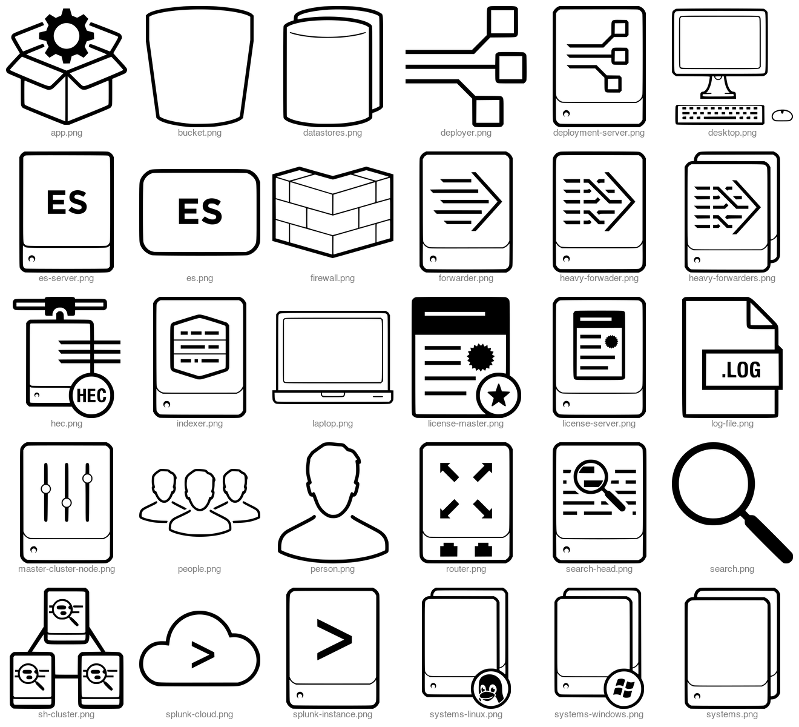

 # splunk-icons-draw-io



### creating a contact sheet

```
montage -verbose \
    -label '%f' -font Helvetica -pointsize 15 \
    -background '#FFFFFF' \
    -fill 'gray' \
    -geometry 200x200+10+10 \
    -auto-orient \
    icons-png/*.png \
    ./contact-sheet.png
```
